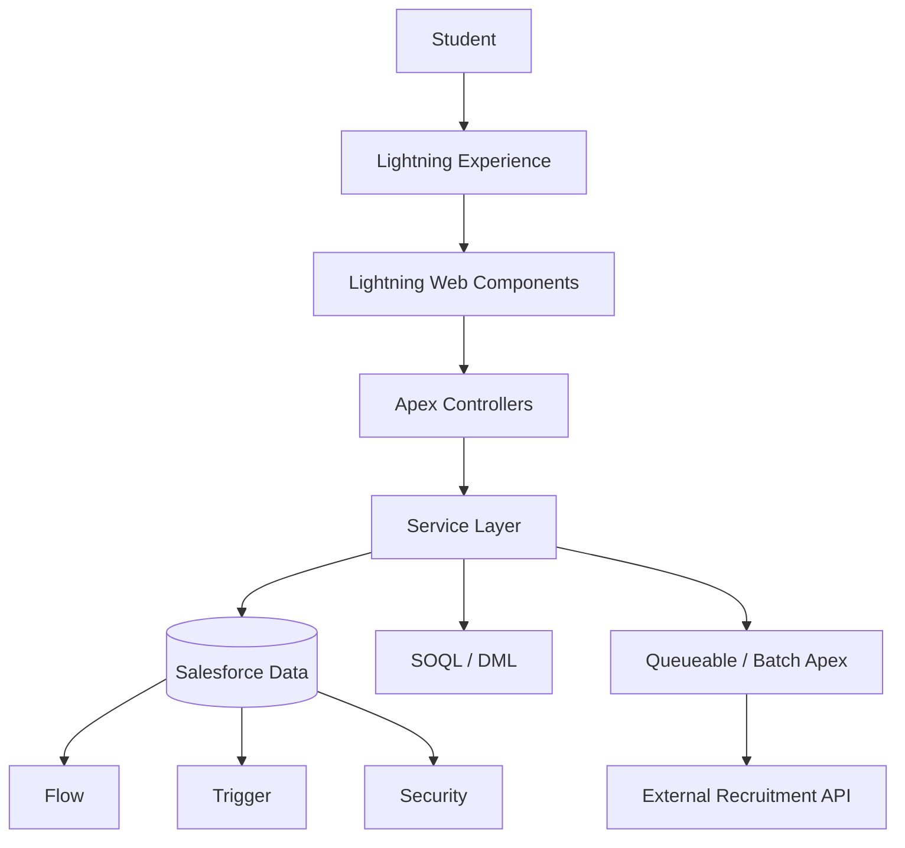

# 🚀 Salesforce Placement Management System

## 📅 Day 14 – Production-Ready Salesforce Application

### 📌 Project Overview

This final sprint focused on transforming the **Placement Management System** from a student project into a **production-ready Salesforce application**. The project integrates architecture, Apex, LWC, security, asynchronous processing, testing, Git, and deployment into one complete solution.

---

## 🚀 Features Implemented

### 🏗️ System Architecture

- Layered Salesforce architecture
- Service-based Apex design
- Lightning Web Components (LWC)
- SOQL & DML data layer
- Flow & Trigger automation
- External REST integration

### ⚙️ Declarative vs Programmatic Design

- Flow for simple automation
- Apex for complex business logic
- LWC for interactive dashboards
- Batch Apex for large data processing
- Queueable Apex for background integrations

### 🛡️ Production Readiness

- Bulk-safe Apex classes
- Thin trigger architecture
- Role-based security
- Permission Sets & Sharing
- Integration using Named Credentials

### 🧪 Testing & Quality

- Happy path testing
- Negative test cases
- Security validation
- Bulk testing
- Trigger & Async testing
- Integration mock scenarios

---

## 🏛️ Final Architecture



---

## 💻 Technologies Used

- Salesforce Platform
- Lightning Web Components (LWC)
- Apex
- SOQL & DML
- Flow
- Apex Triggers
- Queueable Apex
- Batch Apex
- Named Credentials
- REST API
- Git & GitHub
- Salesforce CLI

---

## 📁 Documentation Added

```text
docs/
├── architecture/
│   ├── final-architecture.md
│   └── technology-decisions.md
├── review/
│   └── code-review.md
├── security/
│   ├── security-model.md
│   ├── permission-matrix.md
│   ├── sharing-model.md
│   └── security-test-cases.md
└── testing/
    ├── test-plan.md
    └── interview-notes.md
```

---

## ✅ Sprint Outcome

Successfully completed the final capstone by designing, securing, testing, documenting, and preparing the **Salesforce Placement Management System** for a production-ready deployment using Salesforce best practices.
